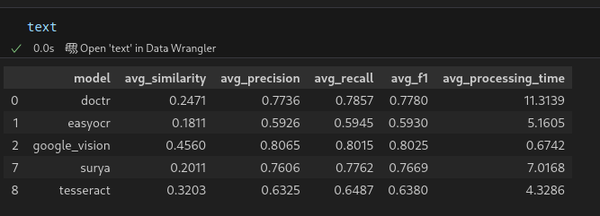
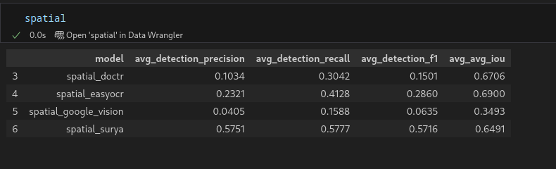

# OCR models comparison

## Installation & Usage

### Requirements
```bash
pip install easyocr pytesseract google-cloud-vision
pip install python-doctr[torch]
pip install surya-ocr
```

### Usage Example
```python
# Initialize models
from complete_ocr_evaluation import initialize_ocr_models, run_single_ocr_evaluation

# Load your samples
samples = load_your_samples()

# Run evaluation
results = run_single_ocr_evaluation(samples, 'google_vision')
```


## Project Structure

```
├── README.md
├── OCR_MODELS_COMPARISON.ipynb    # Main Jupyter notebook
├── complete_ocr_evaluation.py     # Python script version
├── model_comparison_summary.csv   # Results summary
└── datasets/
    ├── English_OCR_dataset/
    └── French_OCR_dataset/
```


## OCR models evalulated

1. **Google Vision API** - Cloud OCR service by Google
2. **Tesseract** - Open-source OCR engine, traditional approach
3. **EasyOCR** - Deep learning-based OCR
4. **DocTR** - Also a deeplearning based OCR
5. **Surya** - Modern OCR with detection and recognition, also deep learning

## Dataset

- **English dataset**: 10 samples (bills/transcripts)
- **French dataset**: 10 samples (book pages)
- **Total**: 20 samples
- **Formats**: Images with annotations (JSON for English, XML for French)

## Evaluation Criteria

### 1. Accuracy

#### Text Recognition Metrics:
- **F1 Score**
- **Precision**
- **Recall**
- **Similarity**: Text similarity

#### Spatial Detection Metrics (for the 4 models that support it, tesseract did not support bbox):
- **F1**: Bounding box detection accuracy
- **avg IoU**: Intersection over Union for detected regions

### 2. Speed
- **Processing Time**: Average time per image (seconds)

### 3. Multilingual Support
- Tested on English and French datasets

### 4. Ease of Integration
- Installation complexity
- API simplicity
- Dependencies requirements

### 5. Cost
- Free vs. paid services
- Usage limitations
- Infrastructure costs

### 6. License/Infrastructure Requirements
- Open source vs. proprietary
- Cloud vs. local deployment
- Hardware requirements

## Evaluation Results

### Performance Summary
- Results with only using text


- Results using both text and bounding box


## Analysis

### 1. Performance

**Google Vision API** 
- Achieves the highest F1 score (0.803) and precision (0.807), has superior text recognition capabilities
- High recall (0.802) shows comprehensive text detection with minimal missed content
- Best similarity score (0.456), gg vision has good text quality
- Leverages Google's massive training datasets and proprietary deep learning models
- Excels at handling various document types, fonts, and image qualities
- Spatial detection performance is surprisingly weak (Detection F1: 0.064, IoU: 0.349), maybe the API prioritizes text accuracy over layout analysis

***Ideal for text content accuracy is more significant than spatial understanding***

**DocTR** 
- Strong F1 score (0.778) with well-balanced precision (0.774) and recall (0.786)
- Great spatial detection capabilities (IoU: 0.671) - highest among all models, so this is ideal for document layout analysis
- Lower text similarity score (0.247) -> challenges with text quality


**Surya** 
- Good F1 score (0.767) with balanced precision (0.761) and recall (0.776)
- Good spatial detection F1 (0.572) - highest among all models
- Good IoU (0.649) demonstrates good localization accuracy
- The spatial aspect is good maybe because of the modern transformer-based architecture provides robust capabilities
- Lower text similarity (0.201) 
- Best choice for applications requiring precise text region detection and modern OCR technology

**Tesseract** 
- Moderate F1 score (0.638) with consistent precision (0.633) and recall (0.649)
- Good similarity score (0.320) - second best after Google Vision, good text matching/quality
- No spatial detection capabilities, limiting use for document structure analysis
- But is CPU-based so can be relatively slow, and is old.
- Suited for simple, clean text extraction where layout is not important

**EasyOCR** 
- Lowest text F1 score (0.593) among all models, has significant accuracy limitations
- Consistent but low precision (0.593) and recall (0.595) 
- Notable spatial performance: low detection F1 (0.286) but highest IoU (0.690) when detection succeeds
- Lowest similarity score (0.181) suggests poor text quality
- Good for quick prototyping and simple OCR tasks


### 2. Speed 

**Google Vision API** - Fastest processing 
- Cloud-based processing leverages Google's infrastructure 
- Speed advantage from distributed computing and optimized models
- Consistent processing times regardless of local hardware capabilities

**Tesseract** 
- CPU-based processing 
- Traditional computer vision algorithms. 
- Consistent performance across different hardware configurations
- No network dependency 
- Performance scales with CPU capabilities but remains relatively fast when paired with traditional CV algos.

**EasyOCR** 
- Deep learning-based but optimized for accessibility and ease of use
- Moderate computational requirements make it suitable for various hardware configurations
- GPU acceleration available but not strictly required
- Processing time reflects the balance between accuracy and computational efficiency
- Good choice for applications where moderate speed and ease of use are priorities

**Surya** 
- Modern deep learning architecture requires more computational resources than traditional methods
- Has GPU acceleration
- Transformer-based models have higher computational requirements but provide better accuracy
- Processing time varies significantly based on available hardware 
- Represents good balance between accuracy and speed for modern OCR applications

**DocTR** 
- Highest computational requirements due to complex deep learning architecture
- Complex pipeline includes both detection and recognition stages
- GPU acceleration strongly required for acceptable performance
- Trade-off between speed and advanced document analysis features
- Not suitable for real-time applications due to speed 
- Slowest model(11s)

### 3. Multilingual Support

**Google Vision** 
- Supports 100+ languages with excellent performance across major language families
- Automatic language detection capabilities 
- Regular updates and improvements to language models 
- Best choice for applications requiring broad multilingual support

**Tesseract** 
- Supports 100+ languages through downloadable language packs
- Long development history
- Performance varies significantly between languages
- Requires manual language specification for optimal performance
- Community-driven language model

**Surya** 
- Supports many languages with focus on modern transformer-based language understanding
- Designed with multilingual capabilities from the ground up
- Active development in language support
- Balanced between language coverage and performance quality

**EasyOCR**
- Supports 80+ languages with emphasis on ease of use
- Just need language specification
- Low implementation complexity
- Good performance on major languages but may struggle with less common scripts
- Also have regular updates 

**DocTR** 
- More limited language support compared to other models
- Focus on document-specific language understanding rather than broad coverage
- Strong performance on supported languages, particularly for document analysis
- May require additional configuration for non-Latin scripts

### 4. Integration 


**Google Vision API** 
- Simple integration(using only API)
- No local model installation
- Comprehensive documentation and client libraries for major programming languages
- No hardware requirements or dependency management on client side
- Authentication through Google Cloud credentials
- Immediate availability without setup time
- Ideal for production deployment with minimal infrastructure

**EasyOCR** 
- Simple Python API with minimal configuration required
- Good documentation and community examples
- Works on most Python environments
- Suitable for requiring quick OCR integration
- Open source

**Tesseract**
- Requires system package installation but still has a Python wrapper
- Language pack management for multilingual support
- Configuration file management for optimal performance
- Well-documented but requires understanding of system dependencies
- Good choice when system-level control is acceptable
- Open source 

**Surya** 
- Modern Python package with dependencies
- Requires GPU for optimal performance
- Good documentation for setup and configuration
- Surya is actually open sourced so we can develop our own version on top of it
- Torchvision and transformer dependent, had a bit of problems when setting this up because of dependencies

**DocTR** 
- Multiple dependency categories: PyTorch, computer vision libraries, document processing tools
- GPU setup strongly recommended for acceptable performance
- Potential version conflicts between dependencies
- Requires understanding of PyTorch ecosystem and CUDA configuration
- More complex model management and configuration options
- Also open source

### 5. Cost and Economic Analysis

**Google Vision API** 
- Direct cost: $1.50 per 1000 requests after free tier (1000 requests/month)
- Hidden costs: potential data egress charges
- Cost predictability: Linear scaling with usage, easy to budget for known volumes
- Economic advantages: No infrastructure costs, no maintenance overhead, immediate scalability
- Cost considerations: Can become expensive for high-volume applications 


**Open Source Models** - Free software with infrastructure costs
- Direct cost: No cost for software licensing
- Infrastructure costs: Server hardware, GPU rental, electricity, maintenance
- Development costs: Integration time, model optimization, troubleshooting
- Operational costs: Monitoring, updates, scaling infrastructure
- Hidden costs: Developer time for setup, maintenance, and optimization
- Economic advantages: No per-request fees, full control over deployment, data privacy
- Long-term considerations: Infrastructure investment pays off for high-volume applications

### 6. License and Infrastructure Requirements

**Google Vision API**
- License: Proprietary service with terms of service restrictions
- Data privacy: Data processed on Google's servers, subject to Google's privacy policies
- Deployment: Cloud-only
- Infrastructure: No local hardware requirements
- Scalability: Automatic scaling handled by Google's infrastructure
- May not meet strict data residency or air-gapped environment requirements
- Dependency on Google's service availability and pricing

**Tesseract**
- License: Apache 2.0 
- Data privacy: Complete local processing, no data leaves your infrastructure
- Deployment: Flexible - local, cloud, or hybrid deployment options
- Infrastructure: CPU-based processing, minimal hardware requirements
- Scalability: Manual scaling through load balancing and horizontal scaling
- Compliance: Suitable for strict data privacy and air-gapped environments
- Independence: No vendor dependencies, full control over deployment and updates

**EasyOCR**
- License: Apache 2.0
- Data privacy: Local processing ensures data privacy and security
- Deployment: Local or cloud deployment with containerization support
- Infrastructure: GPU recommended, CPU fallback available
- Scalability: Good scalability with proper infrastructure planning
- Compliance: Meets most data privacy requirements through local processing
- Community: Active community support and regular updates

**DocTR**
- License: Apache 2.0
- Data privacy: Complete local control over data processing and storage
- Deployment: Requires more sophisticated infrastructure due to PyTorch dependencies
- Infrastructure: GPU recommended for production use
- Scalability: Excellent scalability with good GPU infrastructure
- Maintenance: Requires more technical expertise for deployment and maintenance

**Surya**
- License: Apache 2.0 
- Data privacy: Local processing maintains data privacy and security
- Deployment: Modern containerized deployment options available
- Infrastructure: GPU recommended for performance, moderate resource requirements
- Scalability: scalability potential with modern architecture
- Compliance: Suitable for privacy-conscious applications


### OCR Solution for Hekate 

**Primary Recommendation: Surya + Tesseract Hybrid Approach**

### Reasoning for Hekate Ecosystem

**Business Alignment:**
- Hekate's mission: "Bringing AI benefits to everyone" - requires cost-effective, scalable solutions
- Serves diverse clients from government to enterprises
- Computer Vision services include document classification, OCR with automatic language detection, and face recognition
- Strategic partnerships enable technology integration and infrastructure support
- Focus on Vietnamese market with multilingual capabilities

**Technical Fit:**
- Surya's modern transformer-based architecture provides excellent multilingual capabilities
- Open-source models support Hekate's accessible AI mission and cost structure
- Vietnamese/multilingual support essential for local and international clients
- Can be integrated with existing NLP and Big Data Analytics services

### Trade-off analysis

#### Accuracy vs. latency trade-offs

**Balanced Performance**
- **Surya** for modern OCR with excellent spatial detection 
- **Trade-off**: Moderate processing time with spatial detection and free licensing
- **Use case**: Various types of documents, from complex tosimple, multilingual OCR
- **Revenue**: Standard pricing with higher margins due to no licensing costs

**High Volume/Low latency**
- **Tesseract** for simple text extraction 
- **Trade-off**: Good text accuracy(only loses to Google Vision in previous test) and fast, cost-effective processing
- **Use case**: High-volume text extraction for chatbot training data, basic OCR services
- **Revenue**: Volume-based pricing with excellent margins


#### On-premise vs. Cloud Trade-offs

**On-premise Advantages :**
- **Data sovereignty**: Critical for government clients 
- **Cost control**: No per-request fees for high-volume processing (large user base for Hekate)
- **Customization**: Can fine-tune models for Vietnamese documents and specific client needs
- **Independence**: Aligns with Hekate's goal of accessible AI and reduces vendor dependency
- **Compliance**: Ensure data residency requirements
- **Full control**: Complete ownership of technology stack and data processing


#### Open-source vs. Commercial trade-offs

**Open-source Benefits:**
- **Cost efficiency**: Zero licensing fees support Hekate's accessible AI mission and competitive pricing
- **Customization**: Can adapt models for Vietnamese market specifics and client requirements
- **Independence**: No vendor lock-in, full control over technology stack
- **Innovation**: Can contribute improvement
- **Compliance**: Meets data requirements for government and sensitive clients, ensure data is safe.
- **Scalability**: Can serve large user base without per-request costs
- **Differentiation**: Ability to create proprietary enhancements and Vietnamese-specific optimizations


**Recommendation:**
- On-premise Surya + Tesseract for all services
- Open-source Surya + Tesseract for all use cases
- Maximizes cost efficiency, data control, and aligns with accessible AI mission

